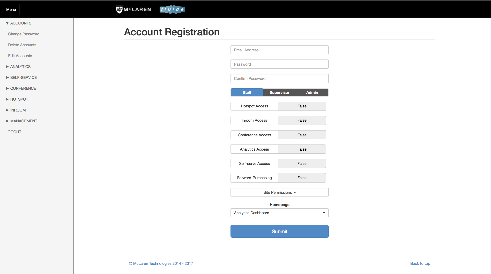

### Accounts

#### Add Account

Accounts are created to allow access to the fluide portal. You'll be required to enter an email address and a password during account creation. The password can be changed by the user once they have logged into fluide.

The permission level \(Staff/Supervisor/Admin\) of the account will be selected during account creation.

To determine which site the account has permission to access, the admin may select the list of sites available in site permissions.

To change the landing page of an account, the admin may click the drop down menu under Homepage and select accordingly.

When creating an admin account \(to be done by admin only\), email address and passwords are part of the login credentials required. Admin accounts will be given access to all modules and sites available, while homepage will default to display the fluide dashboard, this cannot be changed.

#### Change Password

Users may change their passwords after logging in by going to Accounts &gt; Change Password. They will be required to input their existing password and new password. Once they hit the Submit button, the new password will be saved and they can utilize it to log in during their next log in attempt.

#### Delete an account

Admins are given access to delete an account in the fluide portal. When deleting accounts, admins will enter the email of the account to be deleted &gt; hit Submit button and a confirmation screen will be displayed.

If the confirmation screen is not displayed, please check that the email address entered is correct and try again, Please ensure the email address entered is the same as the one the user uses to log in to fluide.

#### Editing an account

Admins are given the rights to modify the paracmeters associated to existing user accounts of all access levels. This includes changing the accounts access to a specific module, configuring the landing page, as well as resetting a users password when required.
