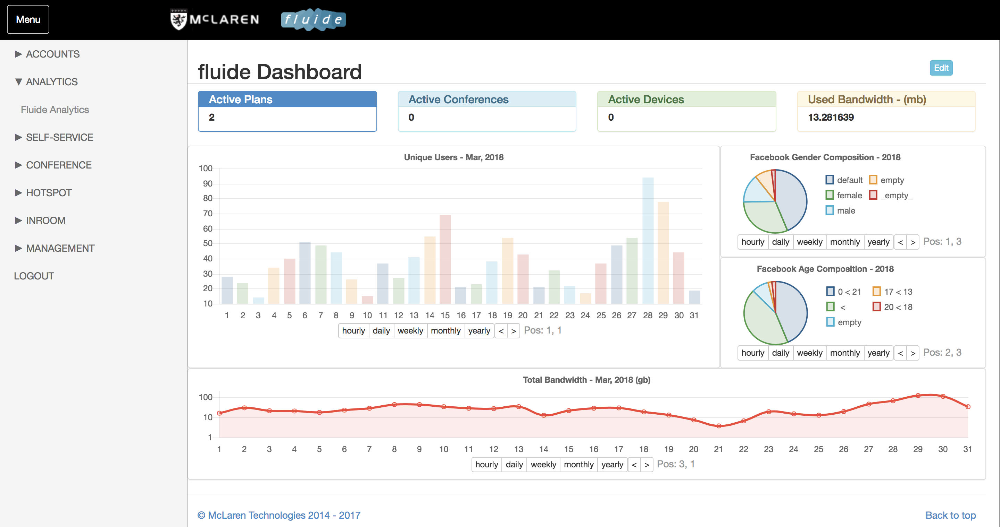

### The fluide Dashboard

The fluide Dashboard, different to the Server Dashboard, provides an overview of active plans, conferences and devices, used bandwidth, users and Facebook statistics. Charts are able to be changed to hourly, daily, weekly, monthly or yearly. The fluide Dashboard can be found under the analytics tab, and on the home page of an admin account.

### fluide Analytics

fluide analytics consists of a number of detailed historical and up to date charts that cover all elements of guest behaviour and Internet utilisation.

The chart types are:

* Average Usage
* Average Duration
* Average Users / Time
* OS Chart
* Total Usage
* Unique Users

All charts are monthly charts with one column per day except for the Average Users / Time chart, which is a daily chart with a granularity which can be set \(see image below\). The OS Chart is monthly, however it is a pie chart.

All charts can be emailed once generated, and a CSV file with the chart data can be attached.
