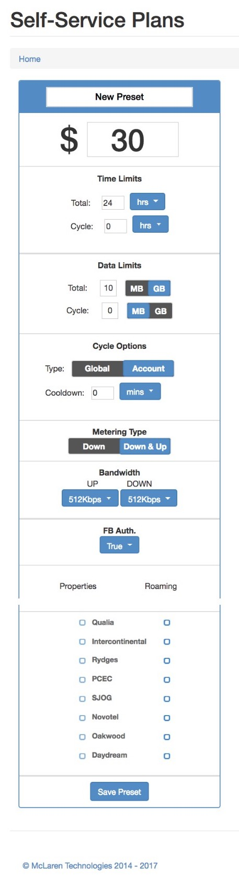

### **Self-service / Inroom / Hotspot**

* Self-service plans are applied automatically to guests logging in to a specific location.
* Inroom plans require a last name and room number to log in and are checked against the property’s PMS.
* Hotspot plans are used to create an access code at the property front desk which is given or emailed to a guest.

The plans mentioned above applies to different guest type, however, the creation and configuration of plans are similar.

#### Add plan

This panel collects all the parameters that need to be defined for a new plan.

|  |  |
| :--- | :--- |
| **Name** | **The name visible to guests.** |
| **Amount** | **For a free plan, enter 0, otherwise enter the dollar amount** |
| **Device Limit** | **The maximum number of devices that can be associated with this plan.** |
| **Time Limit** | **How long the plan will remain active for. Enter 0 for unlimited.** |
| **Cycle** | **How much data over a set amount of time the user has available. Enter 0 for unlimited** |
| **Data Limit** | **The plan will expire after the data limit is reached. Enter 0 for unlimited.** |
| **Metering Type** | **Count all data, or only the download.** |
| **Bandwidth** | **Upstream and downstream speed.** |
| **Loyalty** | **If VIP tags are active in the PMS these can be linked to a plan.** |
| **Properties** | **Locations the plan will be present at.** |
| **Roaming** | **Locations the plan can be used.** |

#### Time and data limits

Time and data limits are used to restrict guest usage. There are two levels of restriction, Total and Cycle.

**Total** time and data limits pertain to the absolute maximum for the plan. For example a total limit of 1GB and 5 days means that the plan will get capped when either one of those limits is reached. There is no restriction of how the data gets consumed. If the guest consumes the data in the first hour, they will get capped and not be able to use their plan for the rest of the time.

**Cycle** limits can be used to further restrict the guest by setting data limits for specific time periods. For example the total could be 5GB and 5 days, with a cycle of 2GB per day. This means no more than 2GB could be used in any one day of the total 5 day plan. Once the cycle limit gets reached, the plan would be disabled for the rest of the cycle period \(in this case for the rest of the day\).

#### Edit plans

On this screen all parameters as described in the Add Plan section above can be edited for any existing plans. Users may also delete an existing plan. TOn this screen, the plans displayed can be edited and deleted. If you are unable to identify a desired plan, please ensure you are looking into the correct module - whether it is self-service, hotspot or inroom.   
