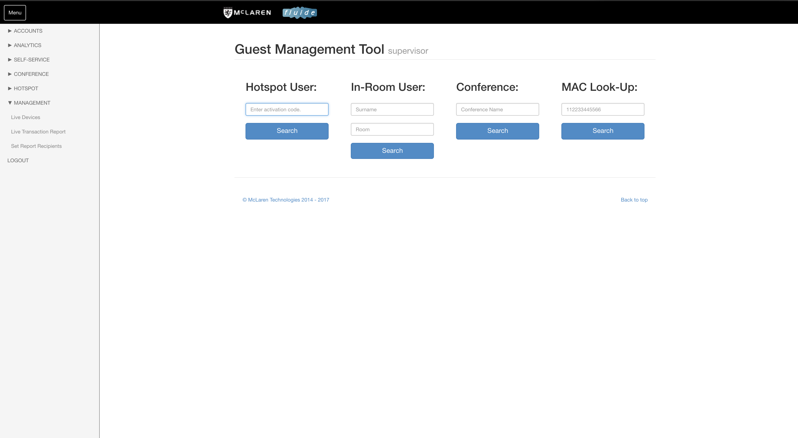

# fluide User Guide

### Document Control

| **Author Name** | **Emma Sciberras** |
| :--- | :--- |
| **Title** | **fluide User Guide** |
| **Author Contact** | **emma-lee.sciberras@mclarenint.com** |
| **Document Name** | **fluide User Guide V2.0** |

#### Version History

| **Version** | **Effective Date** | **Update Originator/Author** | **Reason Comment** |
| :--- | :--- | :--- | :--- |
| **1.0** | **24/11/2016** | **Marc Jonkers** | **Initial Release** |
| **2.0** | **6/07/2018** | **Emma Sciberras** | **Updated Release** |

### fluide Admin Login

The login page for fluide is always

&lt;property&gt;.fluide.mclarenint.com/HSM/HSM.php or &lt;IP address&gt;/HSM/HSM.php

This page will give you a login prompt.

All accounts will consist of an email address and a password. An account can only be created from an existing administrator account within fluide.   

### Access Levels

fluide has three levels of access. The default privileges for each access level are described below. These defaults can be adjusted by McLaren staff to suit each fluide instance. The purpose and usage of the various modules will be explained elsewhere in this document.

#### Staff

This is the base level of access. Staff level users can only create hotspot tickets \(if the hotspot module is in use\) and use the Guest Management Tool to see details about a guest account. They will also have access to Live Devices reports.

#### Supervisor

On top of what's included in staff access, Supervisors will also have the following modules available:

* Add/edit/delete access plans for any of the modules that are enabled for the site \(inroom, hotspot, self-service, conference\)
* Live Transactions report

#### Administrator

Administrators are given access to all areas of fluide.

* Add/edit/delete user accounts
* Set Report Recipients
* fluide Analytics

### **Landing Page & Main Menu**

If the account has administrator rights, the landing page shown is the fluide Dashboard.

If the account does not have administrator rights, the first page will be the Guest Management Tool \(GMT\) page.

The access level will be indicated next to the page name if the user is not of the basic ‘Staff’ level.

The main menu is situated on the left hand side of the screen and is persistent throughout and dynamic. It will only display the items that are available to the access level of the user.
